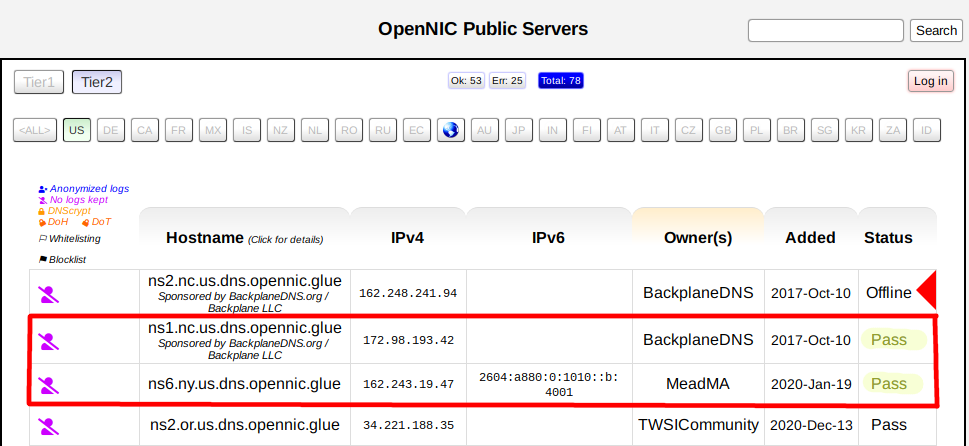
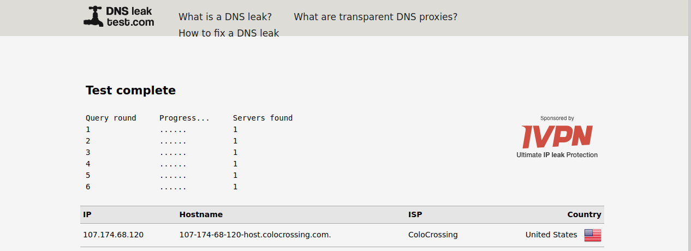

# Headless Torrent Box Tutorial

### Getting Started:

---

**Rasberry Pi 2/3/4**
*This tutorial assumes you've already:*

* Gained a [basic understanding](https://www.udemy.com/course/command-line/) of working with the Linux command line.

* [Installed](https://www.raspberrypi.org/documentation/installation/installing-images) the latest version of [Raspberry Pi OS Lite](https://downloads.raspberrypi.org/raspios_lite_armhf/images/raspios_lite_armhf-2021-01-12/2021-01-11-raspios-buster-armhf-lite.zip), run the `raspi-config` command, and established a working connection to the internet.)*

* [Setup SSH access](https://www.raspberrypi.org/documentation/remote-access/ssh) to your Raspberry Pi.

* Paid for a VPN subscription that will help maintain your privacy.

If you still need a VPN subscription, I'd highly recommened [PrivateInternetAccess.com](http://www.privateinternetaccess.com/pages/buy-a-vpn/1218buyavpn?invite=U2FsdGVkX1-MyKjtJ2elxr-u_Z7E7ZVXuIBDNEY55Ww%2CcTAHlCvPgR3Ct2n3lq3W1M0FF5E). Their prices are very affordable.

*(**Full Disclosure:** The link above is my personal referral link for PrivateInternetAccess.com.)*

### Step-by-Step:

---

1. **Install Prerequisites**

	1. SSH into your RasPi *(with **X11Forwarding** enabled)* and use **apt** *(or **apt-get**)* to install **OpenVPN**, **Transmission**, **unzip**, and **Firefox**.
	
	```
	sudo apt update && sudo apt install openvpn transmission-daemon unzip firefox-esr -y
	```

---

2. **Configure Transmission**

	1. Stop Transmission
	
	```
	sudo systemctl stop transmission-daemon.service
	```

	2. Backup the original config file

	```
	sudo cp /etc/transmission-daemon/settings.json /etc/transmission-daemon/settings.json.bak
	```

	3. Create directory for downloads.

	```
	sudo mkdir /mnt/downloads
	```
	
	4. Use `sudo nano /etc/transmission-daemon/settings.json` to alter the following settings:

		1. Set `"download-dir": "/var/lib/transmission-daemon/downloads"` to `"download-dir": "/mnt/downloads"`

		2. Add your local network IP address(es) - *or any wildcard values* - that you might want to use to the `rpc-whitelist` values, separated by commas. *(Common examples of wildcards for a LAN would be **192.168.\*.\*** or **10.0.0.\***.)*

		3. `"rpc-password": "PASSWORD"`... Replace everything between the quotes with your password.

		4. Change username in `"rpc-username": "USERNAME"` to whatever username you want to use. *(This is completely separate from your computer username.)*
		
		5. Save your changes and exit.
		
	5. Start/enable **Transmission** to load on boot:
	
	```
	sudo systemctl start transmission-daemon.service
	sudo systemctl enable transmission-daemon.service
	```

---

3. **Configure OpenVPN**

	1. Download the [OpenVPN configuration files](https://www.privateinternetaccess.com/openvpn/openvpn.zip) from your VPN service provider. **(Use `wget` to download the zip file.)**
	
	```
	wget https://www.privateinternetaccess.com/openvpn/openvpn.zip
	```
	
	2. Unzip the the file.
	
	```
	unzip openvpn.zip
	```
	
	3. Copy your preferred **.ovpn** configuration file to the `/etc/openvpn` directory as `default.conf`. *(I chose one close to my home in Northern California.)*
	
	```
	sudo cp us_silicon_valley.ovpn /etc/openvpn/default.conf
	```
	
	4. Create a file to store your VPN credentials *(ie. username and password)* by running `sudo nano /etc/openvpn/.creds`.
	
	**Example:**
	```
	user
	password
	```
	To save, hit **CTRL**+**X**, **y**, and **Return**.
	
	5. Run `sudo nano /etc/openvpn/default.conf` and next to `auth-user-pass`, add the credential filename we just made in **step 4**. It should look like this:
	
	**Example:**
	```
	auth-user-pass .creds
	```
	To save, hit **CTRL**+**X**, **y**, and **Return**.
	
	6. Set **OpenVPN** to start on boot:
	
	```
	sudo systemctl enable openvpn@default.service
	```

---

4. **Set Custom DNS Servers**

	1. Choose a DNS service that suits your particular need. Personally, I'm a big fan of **[OpenNIC Public Servers](https://servers.opennicproject.org/)**, as they usually have many servers available, including ones with **no-log** and **anonymized log** options. *(Be sure to **only** use the servers with the **Pass** status and keep them updated, otherwise your default DNS may take over when the others fail.)*

	

	*Once you've selected a suitable set of DNS servers, make sure to copy the IPv4 and IPv6 addresses.*
	
	2. Run `sudo nano /etc/dhcpcd.conf` and add the following line to the bottom of the file:
	
	```
	static domain_name_servers=FIRST.DNS.SERVER.HERE SECOND.DNS.SERVER.HERE
	```
	To save, hit **CTRL**+**X**, **y**, and **Return**.
	
	3. Restart your Raspberry Pi to apply changes:
	
	```
	sudo reboot
	```

---

5. **Check for DNS Leaks**

	1. Once you've reconnected to your Raspberry Pi, run `firefox-esr --kiosk https://dnsleaktest.com`. *(This will run hella slow, so be patient.)*
	
	2. Click the **☰** button on the right side of the browser and click *"Preferences"*.
	
	3. On the *General* section of the preferences page, scroll to the bottom and under *"Network Settings" click the *"Settings"* button.
	
	4. Under *"Configure Proxy Access to the Internet"*, select the *"No proxy"* option. Hit *"OK"* and close the tab.
	
	5. Refresh the **DNSLeakTest.com** tab and hit the *"Extended Test"* button on the right.
	
	6. When the test completes, it should give you a result like this:
	
	
	
	*(If it your result shows unfamiliar DNS servers, you will need to revisit the previous steps to discern the problem.)*

6. 

7. 

8. 

9. 

10.
